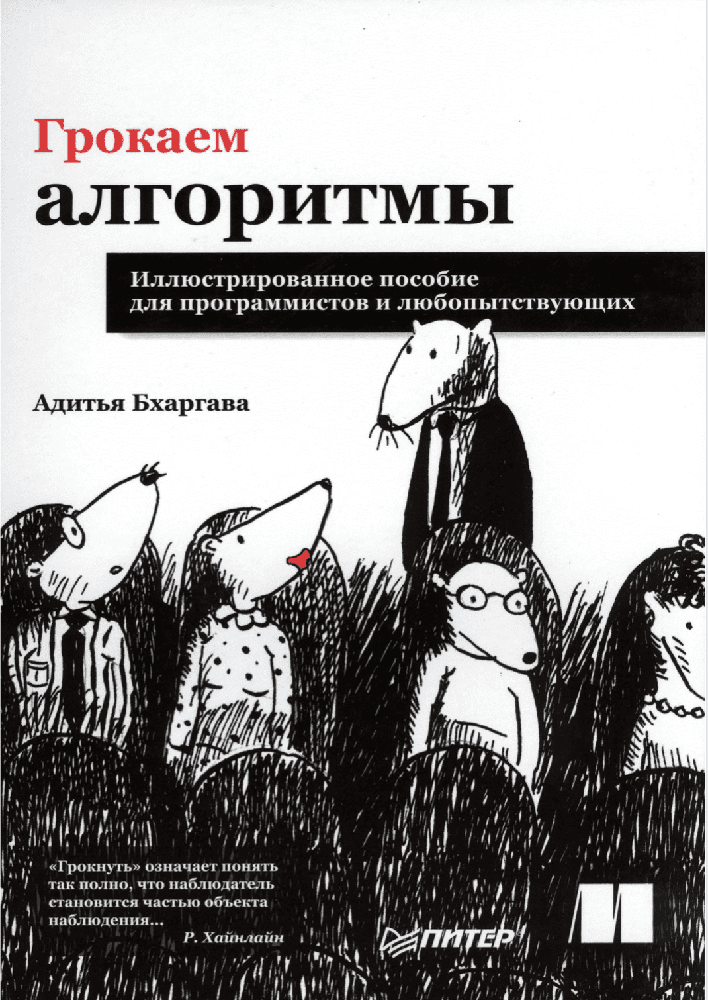

### Hey 👋🏽, I'm Yan 

 
 

Hi, I'm Yan Sakhnevich, a passionate iOS developer 🚀 from Russia. Beside's programming, I enjoy FPV drones.

  
  
**Talking about Personal Stuffs:**

- 👨🏽‍💻 I’m currently studying at the online school "Netology" with a degree in "iOS Developer"
- 💬 Ask me about anything, I am happy to help;
- ⚡  Available for Freelance projects/internship opportunities.
- 📫 How to reach me: yansakhnevich@gmail.com;
- 📝[Resume](https://kazan.hh.ru/resume/e0026d1eff098df3850039ed1f586563637053)

**Languages and Tools:**  
<code></code>
<code></code>

**Readed:**  

    

 

⭐️ From [YanSakhnevich](https://github.com/YanSakhnevich)

