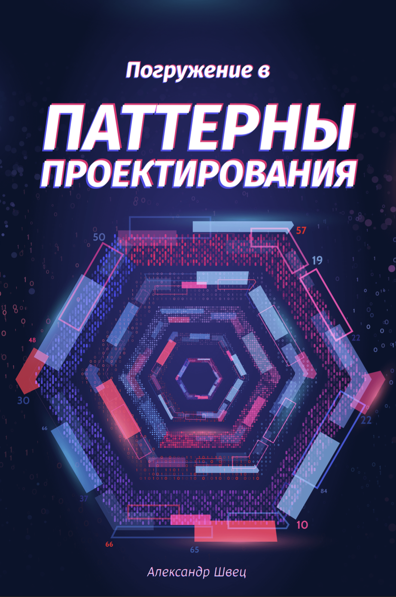
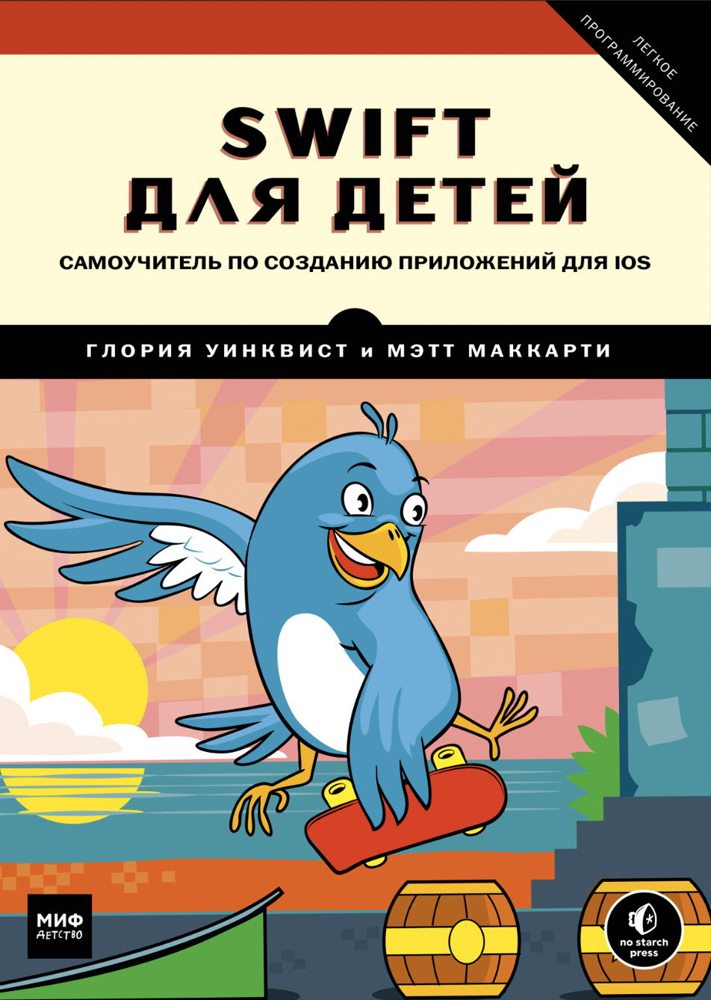
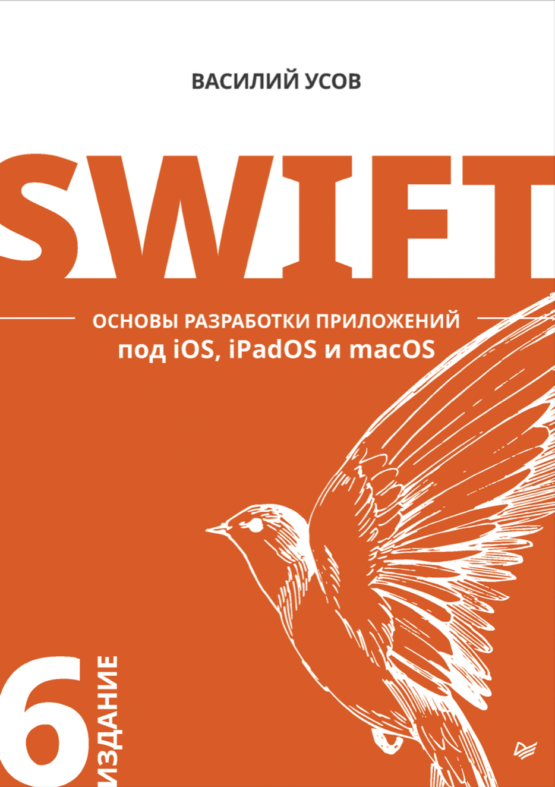

### Hey 👋🏽, I'm Yan 

  

 
 

Hi, I'm Yan, a passionate iOS developer 🚀. Beside's programming, I enjoy FPV drones.

  <!---->
  
 
 

  
**Talking about Personal Stuffs:**
- 👨🏽‍💻  I’m currently studying at the online school "Netology" with a degree in "iOS Developer"
- 💬  Ask me about anything, I am happy to help
- ⚡  Available for Freelance projects/internship opportunities
- 📫  How to reach me: yansakhnevich@gmail.com
- 📝  [Resume](https://kazan.hh.ru/resume/e0026d1eff098df3850039ed1f586563637053)

 
 

**📜 My projects:**
- 🎓  [iOS developer from scratch course](https://github.com/YanSakhnevich/1.-iOS-developer-course)
- 🖇  [Habits App](https://github.com/YanSakhnevich/Project_Habits-UIKit-)
- 🌄  [Landmarks App](https://github.com/YanSakhnevich/Project_Landmarks-UIKit-)
- 📮  [CollectionViewCompositionalLayout App](https://github.com/YanSakhnevich/Project_CollectionViewCompositionalLayout-UIKit-/tree/develop)

 

**🛠 Languages and Tools:** 
 
<code></code>
<code></code>
<code></code>

**📖 Readed:**  

**💻 My working station:**
 
<a href="https://www.apple.com/ru/shop/buy-mac/macbook-pro/13-%D0%B4%D1%8E%D0%B9%D0%BC%D0%BE%D0%B2%D1%8B%D0%B9-%C2%AB%D1%81%D0%B5%D1%80%D1%8B%D0%B9-%D0%BA%D0%BE%D1%81%D0%BC%D0%BE%D1%81%C2%BB-%D1%87%D0%B8%D0%BF-apple-m1-%D1%81-8-%D1%8F%D0%B4%D0%B5%D1%80%D0%BD%D1%8B%D0%BC-%D0%BF%D1%80%D0%BE%D1%86%D0%B5%D1%81%D1%81%D0%BE%D1%80%D0%BE%D0%BC-%D0%B8-8-%D1%8F%D0%B4%D0%B5%D1%80%D0%BD%D1%8B%D0%BC-%D0%B3%D1%80%D0%B0%D1%84%D0%B8%D1%87%D0%B5%D1%81%D0%BA%D0%B8%D0%BC-%D0%BF%D1%80%D0%BE%D1%86%D0%B5%D1%81%D1%81%D0%BE%D1%80%D0%BE%D0%BC-256%D0%B3%D0%B1"> </a>

 

<!--  -->

